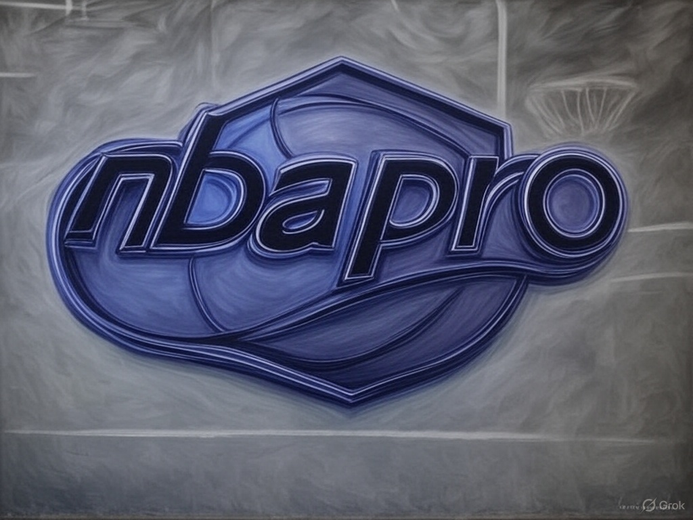

# 🏀 NBAPRO 🏀

  

<h3 align="center">
  <a href="https://nbapro.online">✨ NBAPRO.ONLINE ✨</a>
</h3>

  

  
  
  

  🔮 Quantum-powered basketball analytics matrix 
  🧠 Neural processing of game vectors 
  📊 Dimensional data visualization 
  🚀 Real-time performance metrics

  

  <i>Accessing the basketball multiverse, one stat at a time</i> 🌌

